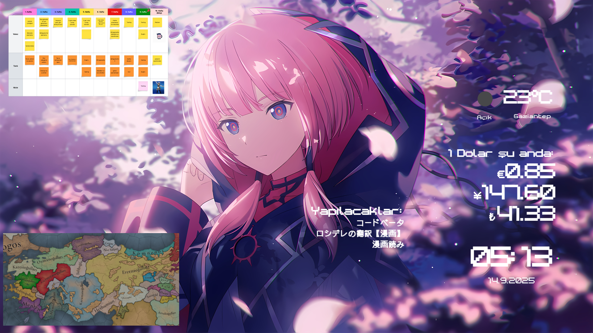

# Focus Lively

A minimalistic live wallpaper to help your focus.

You can change background, ApiKey, etc. via customization menu.

I recommend to create a shortcut to desktop

## Customizations

### API URL:

You can get Api url from [Openweather.org](https://openweathermap.org/)

### Currency:

You can find all possible currencies from [here](https://cdn.jsdelivr.net/npm/@fawazahmed0/currency-api@latest/v1/currencies.json).

You can Ctrl-f.

### Background:

Your background in png/jpg/webm format.

**NOTE**: You can recommend a format from [issues](https://github.com/Tarik366/focus-lively/issues)

### Vertical Background:

Your background in png/jpg/webm format for when your screen in portrait mode.

### Schedule:

Image on the left top

### Beloved image:

Image on the left bottom
